目录：
- [第1章 课程介绍](#1_intro)
- [第2章 环境搭建](#2_env)
    - [2-1 项目所需组件简介](#2_1)
    - [2-2 go开发环境搭建](#2_2)
    - [2-3 【扩展】Go开发环境搭建之Windows篇](#2_3)
    - [2-4 Beego框架初体验](#2_4)
    - [2-5 基于Beego搭建Web应用框架](#2_5)
    - [2-6 MySQL安装及应用](#2_6)
    - [2-7 Beego之ORM初实践（上）](#2_7)
    - [2-8 Beego之ORM初实践（下）](#2_8)
    - [2-9 【扩展】Beego ORM 应用小结](#2_9)
    - [2-10 【总结】知识点回顾](#2_10)
- [第3章 V1.0 : Beego快速搭建Web应用【业务快速迭代】](#3_site)
    - [3-1 大型Web架构设计概要](#3_1)
    - [3-2 读书社区需求分析](#3_2)
    - [3-3\4\5 Web应用框架搭建技巧](#3_3)
    - [3-6 Web应用搭建技巧之重构dbinit](#3_6)
    - [3-7 项目整体分析到Controller结构](#3_7)
    - [3-8 添加view资源](#3_8)
    - [3-9 【笔记】View构建及其资源准备](#3_9)
    - [3-10 【扩展】Beego之View基础实践](#3_10)
    - [3-11 一切从model定义开始](#3_11)
    - [3-12 首页Controller实践](#3_12)
    - [3-13\14\15 分类逻辑开发](#3_13)
    - [3-16 图书详情、编辑模块设计思路讲解 ](#3_16)
    - [3-17 图书管理、分类管理模块设计分析](#3_17)
    - [3-18 生成图书内容数据](#3_18)
    - [3-19 构造搜索查询 ](#3_19)
    - [3-20/21/22 搜索功能逻辑实现](#3_20)
    - [3-23 登录注册验证设计思路简介](#3_23)
    - [3-24 社区功能浅析](#3_24)
    - [3-25/26/27/28/29 构建社区功能](#3_25)
    - [3-30 个人主页剩余模块设计思路讲解](#3_30)
    - [3-31 打包部署](#3_31)
    - [3-32 项目回顾与总结](#3_32)
- [第4章 V1.1 : 补齐短板【MySQL基础优化】](#4_mysql)
    - [4-1 数据库基础优化导读](#4_1)
    - [4-2 【扩展】ab(Apache Bench)基础使用教程](#4_2)
    - [4-3 ab压测评估整体并发能力](#4_3)
    - [4-4 为什么查询会慢](#4_4)
    - [4-5 【扩展】MySQL查询执行计划详解](#4_5)
    - [4-6 项目开发中怎样设计数据表](#4_6)
    - [4-7 数据表设计实战](#4_7)
    - [4-8 实战数据库索引优化](#4_8)
    - [4-9 索引优化实战](#4_9)
    - [4-10 优化改造数据查询语句](#4_10)
    - [4-11 查询优化性能测试](#4_11)
    - [4-12 【总结】数据库基础优化](#4_12)
- [第5章 V1.5 : 优化数据层并发【MySQL并发优化】](#5_upgrade)
    - [5-1 数据库并发优化背景简介](#5_1)
    - [5-2 数据库连接池讲解](#5_2)
    - [5-3 【笔记】Go 连接池分析](#5_3)
    - [5-4 Comments分表设计思路与配置](#5_4)
    - [5-5 Comments分表与程序重构](#5_5)
    - [5-6 MySQL binlog初识](#5_6)
    - [5-7 docker基础操作简介](#5_7)
    - [5-8 基于binlog搭建MySQL主从服务](#5_8)
    - [5-9 【笔记】Docker搭建MySQL主从](#5_9)
    - [5-10 基于应用层的MySQL读写分离实践](#5_10)
    - [5-11 设计模块分库思路讲解](#5_11)
    - [5-12 数据库垂直拆分应用实践](#5_12)
- [第6章 V1.8 : 搜索模块优化【搜索模块接入ElasticSearch】](#6_es)
    - [6-1 MySQL全文搜索性能评估](#6_1)
    - [6-2 Elasticsearch简介](#6_2)
    - [6-3 安装ES搜索引擎](#6_3)
    - [6-4 Elasticsearch使用基础](#6_4)
    - [6-5 搭建Elasticsearch模块框架](#6_5)
    - [6-6 Elasticsearch创建索引](#6_6)
    - [6-7 搜索模块分析](#6_7)
    - [6-8 搜索模块开发实现](#6_8)
- [第7章 V2.0:静态缓存优化【页面静态化与伪静态化】](#7_static)
    - [7-1 页面静态化与伪静态化简介](#7_1)
    - [7-2 页面静态化方案分析](#7_2)
    - [7-3 filecache包使用简介](#7_3)
    - [7-4 搭建页面静态化框架](#7_4)
    - [7-5 实现pagecache逻辑封装（上）](#7_5)
    - [7-6 实现pagecache逻辑封装（下）](#7_6)
    - [7-7 在BaseController中实现页面静态化](#7_7)
    - [7-8 页面静态化性能测试](#7_8)
    - [7-9 Beego 伪静态化实践](#7_9)
    - [7-10 清理过期缓存文件](#7_10)
    - [7-11 分类缓存改造](#7_11)
- [第8章 V2.1:动态缓存优化【基于Redis的动态缓存实践】](#8_redis)
    - [8-1 动态缓存应用简介](#8_1)
    - [8-2 安装redis服务](#8_2)
    - [8-3 redis基础应用简介](#8_3)
    - [8-4 【笔记】Redis安装以及基础使用](#8_4)
    - [8-5 Go实战Redis基础（上）](#8_5)
    - [8-6 Go实战Redis基础（下）](#8_6)
    - [8-7 初始化动态缓存](#8_7)
    - [8-8 封装redis的Do方法](#8_8)
    - [8-9 dynamicache工具方法封装](#8_9)
    - [8-10 实现图书详情页动态缓存逻辑](#8_10)
    - [8-11 实现社区化个人主页动态缓存逻辑](#8_11)
- [第9章 V2.2 : 文件下载优化【文件服务拆分与CDN接入】](#9_cdn)
- [第10章 V2.5 : Web服务并发优化【基于Nginx的负载均衡实践】](#10_nginx)

    
<a name="1_intro"></a>
# 第1章 课程介绍
## Web架构之路 Go实战千万PV读书社区
### 成长之路的反思
- 开发到架构的跨越
- 缺少实际业务场景挑战
- 缺少不失时机的引导

学习开发最快的方式：**在开发中学习开发**

## 大型Web开发&架构
### 读书社区
- 从零开发一个读书社区
- 开发&架构有机结合
- 立体化项目过程


#### V1.0 业务快速大家
- 基于Beego快速搭建Web应用
- 选取了`首页&分类&详情`模块进行快速构建以学习架构知识
- `社区`模块搭建，包括评论和评分功能
- `搜索`模块搭建，也是经常需要优化的模块

#### V1.1~V1.5 并发优化之数据层优化
- 与开发相关的数据层基础优化
- MySQL binlog与主从分离实现
- MySQL 分表分库
- 搜索模块接入 Elasticsearch

#### V2.0~V2.2 并发优化之缓存层优化
- 页面静态化
- 基于Redis的动态缓存实现
- CDN下载优化

#### V2.5 并发优化之服务层优化
- 代理与反向代理
- 无状态服务于服务平行扩展
- 负载均衡原理及其基于Nginx实践
- 多机部署之Session同步问题

### 主要学习知识
- Go开发Web应用
- 敏捷开发编码
- 数据查询优化
- 读写分离
- 分表分库
- 静态化
- 动态缓存
- 负责均衡

[第1章 课程介绍 github 更新对比](https://github.com/custergo/mbook/commit/1ba20192b8248a839d427a4cd31d27a355a99747)

<a name="2_env"></a>
# 第2章 环境搭建
<a name="2_1"></a>
## 2-1 项目所需组件简介
- 首页分类管理
- 搜索模块
- 管理模块
- 个人主页
----
- 主要的是动态数据的查询和管理
    - Go Beego
    - MySQL

<a name="2_2"></a>
## 2-2 go开发环境搭建

项目构建好在服务器运行时，是不需要任何运行环境的，只需要编译好的二进制文件，执行即可。

[golang.google.cn](https://golang.google.cn/)

[studygolang.com](https://studygolang.com/)

在这里go的版本是 `go version` go version go1.13.6 windows/amd64

~~在项目根目录下执行 `go mod init github.com/custergo/mbook` 生成了 `go.mod` 文件，目前github.com/beego/bee工具不支持go mod~~

~~将项目放在GOPATH/src(C:\Go\src\custergo)下~~

<a name="2_3"></a>
## 2-3 【扩展】Go开发环境搭建之Windows篇
<a name="2_4"></a>
## 2-4 Beego框架初体验

下载安装 [beego](https://beego.me/)

`go get github.com/astaxie/beego`

创建文件 hello.go

```go
package main

import "github.com/astaxie/beego"

func main() {
    beego.Run()
}
```

编译运行

`go build -o hello hello.go`

`./hello`

或直接执行 `go run main.go`

浏览效果,打开浏览器并访问 http://localhost:8080

<a name="2_5"></a>
## 2-5 基于Beego搭建Web应用框架

先下载安装 [bee](https://github.com/beego/bee) 工具 `go get github.com/beego/bee`

```shell
PS C:\Users\pc\go\bin> .\bee.exe version
______
| ___ \
| |_/ /  ___   ___
| ___ \ / _ \ / _ \
| |_/ /|  __/|  __/
\____/  \___| \___| v1.10.0

├── Beego     : Beego is not installed. Please do consider installing it first: https://github.com/astaxie/beego
├── GoVersion : go1.13.6
├── GOOS      : windows
├── GOARCH    : amd64
├── NumCPU    : 8
├── GOPATH    : C:\Users\pc\go
├── GOROOT    : c:\go
├── Compiler  : gc
└── Date      : Tuesday, 14 Jan 2020
```

bee new - To create a new Beego web application:

```bash
 PS C:\Users\pc\go\bin> bee new hello
______
| ___ \
| |_/ /  ___   ___
| ___ \ / _ \ / _ \
| |_/ /|  __/|  __/
\____/  \___| \___| v1.10.0
2020/01/14 17:34:38 WARN     ▶ 0001 You current workdir is not inside $GOPATH/src.
2020/01/14 17:34:38 INFO     ▶ 0002 Creating application...
        create   C:\Users\pc\go\src\hello\
        create   C:\Users\pc\go\src\hello\conf\
        create   C:\Users\pc\go\src\hello\controllers\
        create   C:\Users\pc\go\src\hello\models\
        create   C:\Users\pc\go\src\hello\routers\
        create   C:\Users\pc\go\src\hello\tests\
        create   C:\Users\pc\go\src\hello\static\
        create   C:\Users\pc\go\src\hello\static\js\
        create   C:\Users\pc\go\src\hello\static\css\
        create   C:\Users\pc\go\src\hello\static\img\
        create   C:\Users\pc\go\src\hello\views\
        create   C:\Users\pc\go\src\hello\conf\app.conf
        create   C:\Users\pc\go\src\hello\controllers\default.go
        create   C:\Users\pc\go\src\hello\views\index.tpl
        create   C:\Users\pc\go\src\hello\routers\router.go
        create   C:\Users\pc\go\src\hello\tests\default_test.go
        create   C:\Users\pc\go\src\hello\main.go
2020/01/14 17:34:38 SUCCESS  ▶ 0003 New application successfully created!
```

生成的目录

```shell
C:\USERS\PC\GO\SRC\HELLO
├─conf
├─controllers
├─models
├─routers
├─static
│  ├─css
│  ├─img
│  └─js
├─tests
└─views
```

在当前目录`C:\USERS\PC\GO\SRC\HELLO` 直接执行 `bee run`

```shell
PS C:\USERS\PC\GO\SRC\HELLO> bee run
______
| ___ \
| |_/ /  ___   ___
| ___ \ / _ \ / _ \
| |_/ /|  __/|  __/
\____/  \___| \___| v1.10.0
2020/01/14 17:47:30 WARN     ▶ 0001 Running application outside of GOPATH
2020/01/14 17:47:30 INFO     ▶ 0002 Using 'HELLO' as 'appname'
2020/01/14 17:47:30 INFO     ▶ 0003 Initializing watcher...
hello/controllers
hello/routers
hello
2020/01/14 17:47:33 SUCCESS  ▶ 0004 Built Successfully!
2020/01/14 17:47:33 INFO     ▶ 0005 Restarting 'HELLO.exe'...
2020/01/14 17:47:33 SUCCESS  ▶ 0006 './HELLO.exe' is running...
2020/01/14 17:47:34.432 [I] [asm_amd64.s:1357]  http server Running on http://:8080
2020/01/14 17:47:45.995 [D] [server.go:2802]  |            ::1| 200 |     3.0007ms|   match| GET      /     r:/
```

可以打开浏览器直接访问  http://localhost:8080/ 

<a name="2_6"></a>
## 2-6 MySQL安装及应用

https://www.mysql.com/ 在官网下面的链接中找到 MySQL Community Server

或者直接访问 https://dev.mysql.com/downloads/mysql/ 下载社区版

mysql官网有客户端工具 MySQL Workbench https://dev.mysql.com/downloads/workbench/

这里使用 Navicat 工具

新建数据库test 
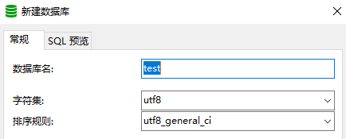

新建表字段
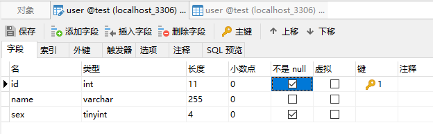

添加字段
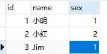

现在在代码中访问mysql中的数据

首先在models文件夹下新建文件`testuser.go`

```go
package models

import (
	"fmt"
	"database/sql"
	_ "github.com/go-sql-driver/mysql"
)

func PrintUser() {
	db, err := sql.Open("mysql", "root:root1234@tcp(127.0.0.1:3306)/test?charset=utf8")
	defer db.Close()
	if err != nil {
		return 
	}
	
	stmt, err := db.Prepare("select * from user limit 10")
	defer stmt.Close()
	if err != nil {
		return
	}

	rows, err := stmt.Query()
	defer rows.Close()
	if err != nil {
		return
	}

	for rows.Next() {
		var id int
		var name string
		var sex int8
		rows.Scan(&id, &name, &sex)
		fmt.Println(id, name, sex)
	}
}
```

修改 controllers\default.go

```go
package controllers

import (
	"github.com/astaxie/beego"
	"hello/models"
	"fmt"
)

type MainController struct {
	beego.Controller
}

func (c *MainController) Get() {
	c.Data["Website"] = "beego.me"
	c.Data["Email"] = "astaxie@gmail.com"
	c.TplName = "index.tpl"
}

func (c *MainController) Hi() {
	fmt.Println("hi console")
	models.PrintUser()
	c.TplName = "index.tpl"
}
```

修改 routers\router.go

```go
package routers

import (
	"hello/controllers"
	"github.com/astaxie/beego"
)

func init() {
	beego.Router("/", &controllers.MainController{})
	beego.Router("/hi", &controllers.MainController{},"get:Hi")
}
```

运行 `bee run` 访问浏览器 http://localhost:8080/hi

可以查看到控制台输出 

```shell
hi console
1 小明 1
2 小红 2
3 Jim 1
```

<a name="2_7"></a>
## 2-7 Beego之ORM初实践（上）
<a name="2_8"></a>
## 2-8 Beego之ORM初实践（下）
<a name="2_9"></a>
## 2-9 【扩展】Beego ORM 应用小结

Beego ORM 是一个使用便捷，有助于快速开发的 ORM 框架，其使用流程相对比较简洁。我们一起来看一下其使用的几个环节。

### orm初始化流程：
1.先注册一个别名为"default"的DataBase，调用函数

`orm.RegisterDataBase(aliasName, driverName, dataSource string, params ...int) `

函数名参数含义如下：

> `aliasName`: 数据库别名。同一进程中可以注册多个数据库，这个参数用来在 ORM 中切换数据库使用，多个别名中必须有一个缺省的"default"
>
> `driverName`:驱动名，可以取"mysql","sqlite"等
>
> `dataSource`:数据库源配置链接字符串，和Go的database/sql包打开数据库连接时传入的参数一样。如`"username:password@tcp(127.0.0.1:3306)/db_name?charset=utf8"`
>
> `params`:这是个变长参数，params[0]:设置最大空闲连接 ,params[1]:设置最大数据库连接

2.注册model，调用函数

`orm.(models ...interface{})`

参数含义如下：

> `models`:变长参数，这里可传入一个或多个model实例，如:
> `orm.RegisterModel(new(Book), new(User))`

3.根据Model定义，自动创建数据表

`orm.RunSyncdb(name string, force bool, verbose bool)`

参数含义如下:

> `name`：数据库别名
> `force`：true:发生错误时，继续执行下一条sql
> `verbose`：true:打印详细信息 

以上三步，在实际应用中可能如下：

```go
// 注册 default database，并设置数据库连接池最大空闲连接数为30
orm.RegisterDataBase("default", "mysql", "username:password@tcp(127.0.0.1:3306)/db_name?charset=utf8", 30)

//注册 model
orm.RegisterModel(new(User))

// 自动建表
orm.RunSyncdb("default", false, true)
```
### 数据读写
在读写数据方面，Beego ORM采用简单的 CRUD 风格，操作简便。我们看下面的例子:

```go
o := orm.NewOrm()
o.Using("default") // 默认使用 default，你可以指定为其他数据库

user := User{Id: 1}
user.Nickname = "admin"
o.Insert(&user)

user.Phone="18001010101"
o.Update(&user)
o.Read(&user,"phone")  //查询phone="18001010101"的用户信息

o.Delete(&User{Id: 1})  //删除Id为1的用户
```

其中，Read函数原型如下:

```go
Read(md interface{}, cols ...string) error
//参数说明
cols:以cols所指的字段构造sql查询
```

而Update函数原型的cols参数含义略有不同

```go
Update(md interface{}, cols ...string) (int64, error)
//参数
cols:制定需要更新的字段
md:model对象，需给主键赋值。
```

Delete函数原型和Update比较类似，参数意义也相同。

`Delete(md interface{}, cols ...string) (int64, error)`

### 其他
1.Beego ORM支持原生sql查询，比如：

```go
ids := []int{1, 2, 3}
p.Raw("SELECT name FROM user WHERE id IN (?, ?, ?)", ids)
```

2.在使用多数据库的场景时，只要在执行查询前，使用Using函数切换即可:

```go
o:=orm.NewOrm()
o.Using("default")  //切换到别名是default的database
...
```

Using函数原型如下:

```go
Using(name string) error
name：数据库别名
```

我们可以看到，Beego ORM的基本使用还是相当便捷的，可以很好帮助我们提升开发效率。但也并非十全十美，比如：原生并不支持分表。

<a name="2_10"></a>
## 2-10 【总结】知识点回顾]
在开发Go的Web服务之前，通常我们需要做以下准备：
1.Go开发编译环境
2.MySQL服务
为了减少开发工作量，提升开发效率，我们又引进了Go语言的Web开发框架Beego。其中Beego提供了一个集开发、调试打包为一体的工具Bee。

首先，我们来回顾一下安装Go编译环境的几个关键知识点。

### 1.GOROOT和GOPATH

- 安装完Go后，要确认两个环境变量是否设置正确，一个是GOROOT，另一个是GOPATH。
- 其中，GOROOT是Go工具安装路径，在$GOROOT/bin目录下，有二进制可执行文件"go"
- GOPATH相当于是一个全局的工作目录，通常我们安装的依赖包放在GOPATH下面。

### 2.go命令使用
go命令的格式如下

`go <command> [arguments]`

常见的command有build,run,get,install等

>	build       编译程序
>	get         下载和安装所依赖的包
>	install     编译和安装程序
>	run         编译并执行程序

这里我们可以看到，go命令覆盖了编译、安装、以及依赖管理等功能。

### 3.Beego框架
使用go命令安装Beego框架，框架安装到$GOPATH下。

`go get github.com/astaxie/beego`

Beego框架适用于开发Web应用开发，是一个典型的MVC风格的开发框架，此外还提供了CRUD风格的ORM模块。如果大家之前做过PHP开发的话，会发现Beego框架的一些习惯和PHP框架的习惯特别像，所以PHPer上手会比较快。

一般的，一个Beego应用的目录结构如下所示：

```shell
├── conf
│   └── app.conf
├── controllers
│   ├── admin
│   └── default.go
├── main.go
├── models
│   └── models.go
├── static
│   ├── css
│   ├── ico
│   ├── img
│   └── js
└── views
    ├── admin
    └── index.tpl
```

从上面的目录结构，我们可以看出来 M（models 目录）、V（views 目录）和 C（controllers 目录）的结构， main.go 是入口文件。另外，conf目录下放置配置文件，static目录默认放静态资源。

### 4.MySQL安装
通常，我们可以在MySQL官网 https://www.mysql.com/

下载MySQL安装包，选择对应系统下的安装包，双击安装。

需要注意的是，我们开发一般使用“MySQL Community Server”版本，不要下载企业版。

另外，如果是Linux或Mac系统，可以选择系统包管理器安装。如Ubuntu的apt-get命令和Mac的brew命令。

<a name="3_site"></a>
# 第3章 V1.0 : Beego快速搭建Web应用【业务快速迭代】
<a name="3_1"></a>
## 3-1 大型Web架构设计概要 
### Web架构演进
- 一切都恰如其分(像微风)
- 一个连续不断的过程(像河流)

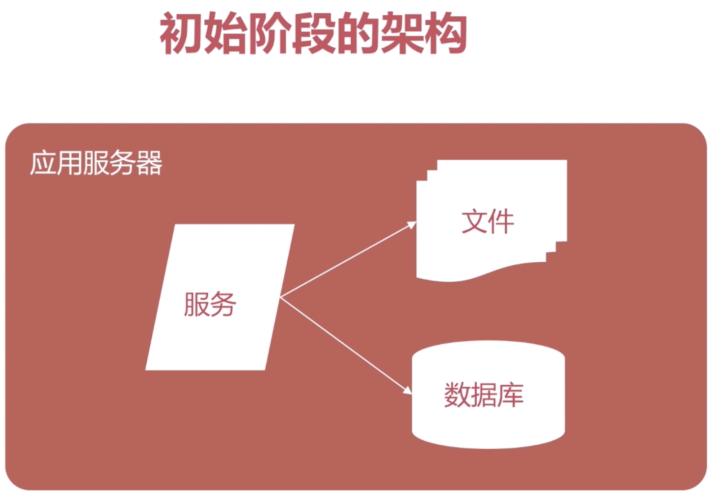

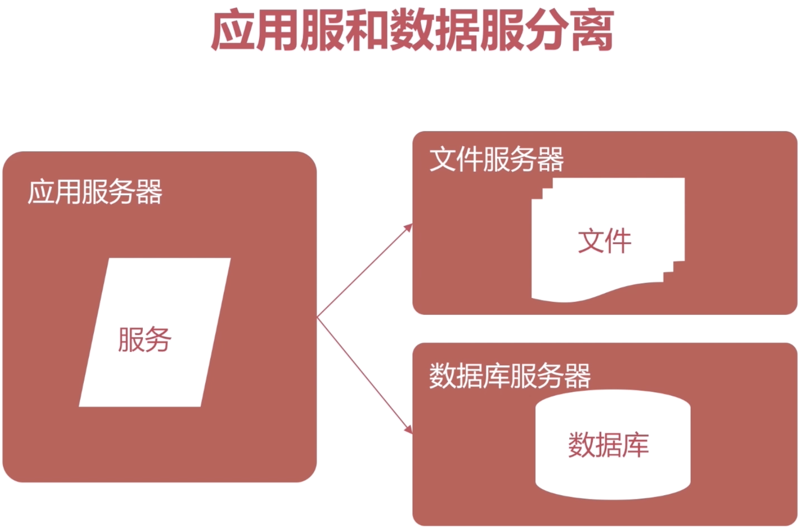

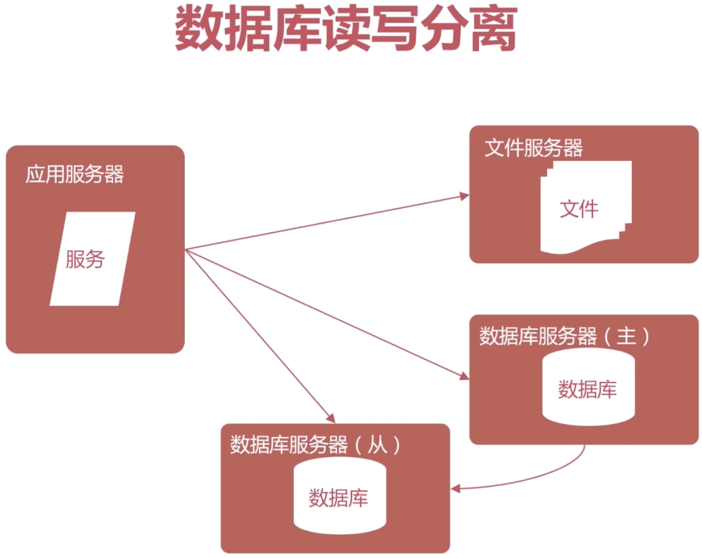

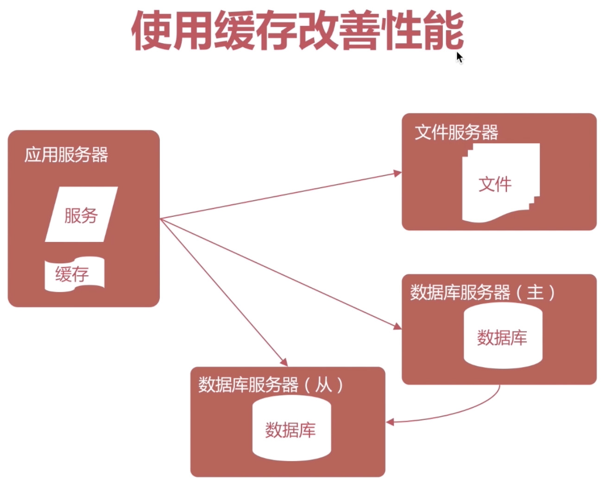

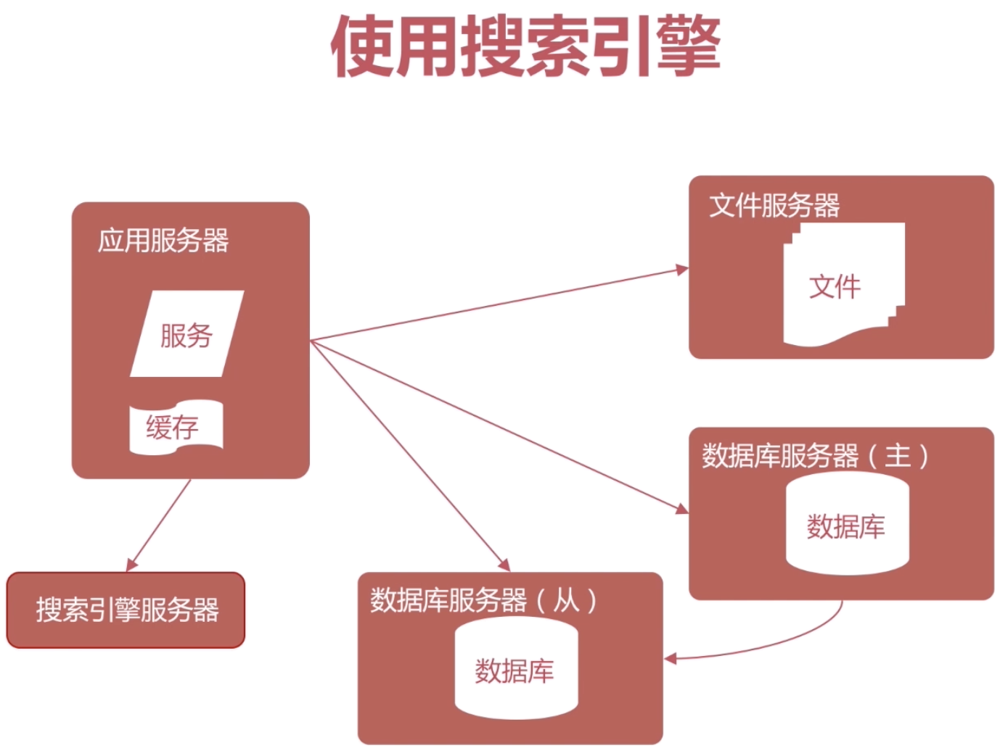

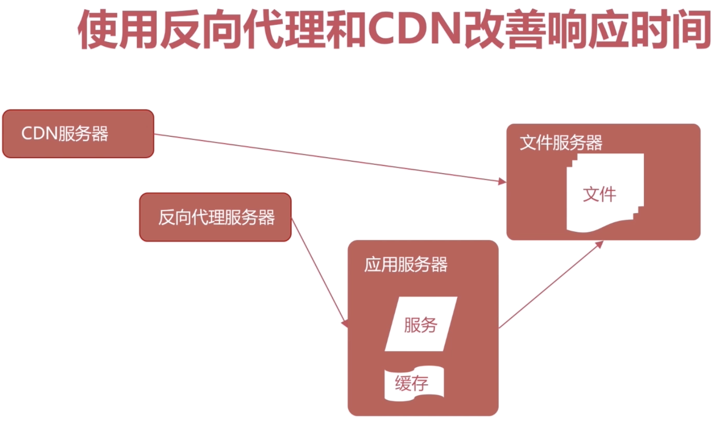

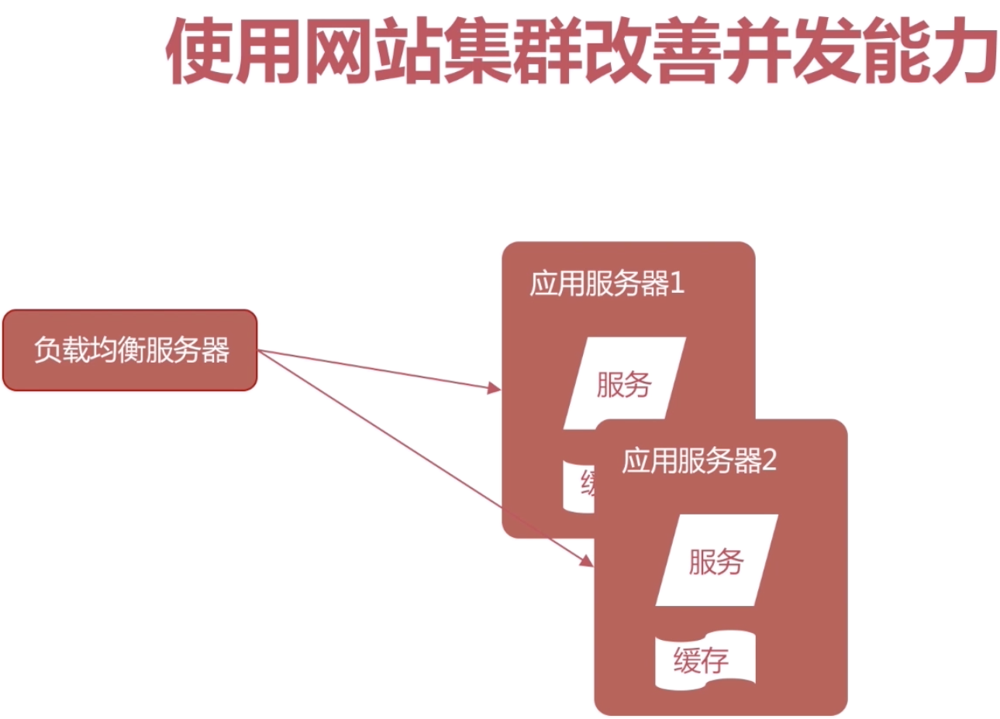

<a name="3_2"></a>
## 3-2 读书社区需求分析
### 业务快速迭代上线

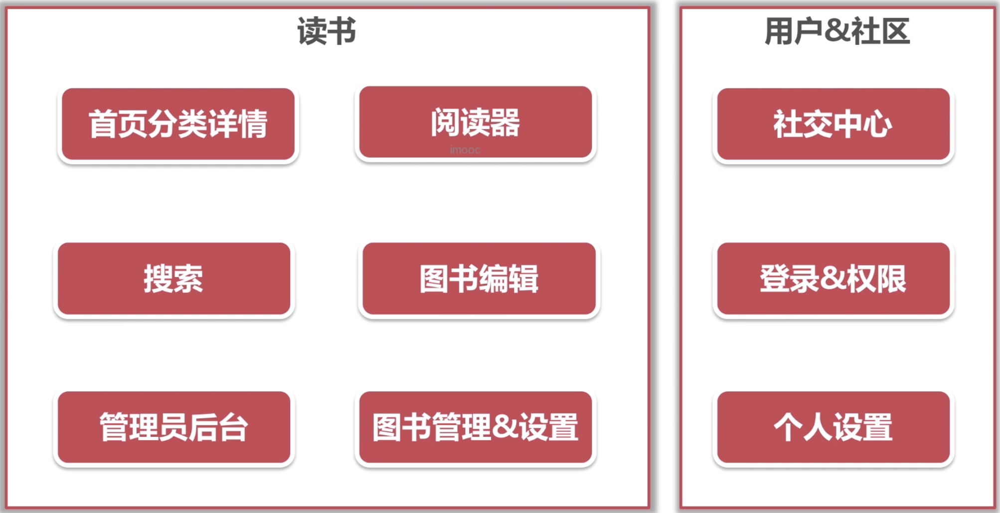

- 首页、分类、详情
    - 分类首页
    - 分类详情
    - 图书详情
- 阅读器
    - 章节、内容
    - 章节搜索
- 图书编辑
    - 编辑图书属性
    - 创建、删除章节
    - 章节、内容编辑
    - 上传、删除附件
- 搜索模块
    - 创建索引
    - 内容搜索
- 图书管理设置
    - “我的”图书
    - 创建图书
    - 图书设置
- 管理员后台
    - 站点设置
    - 分类设置

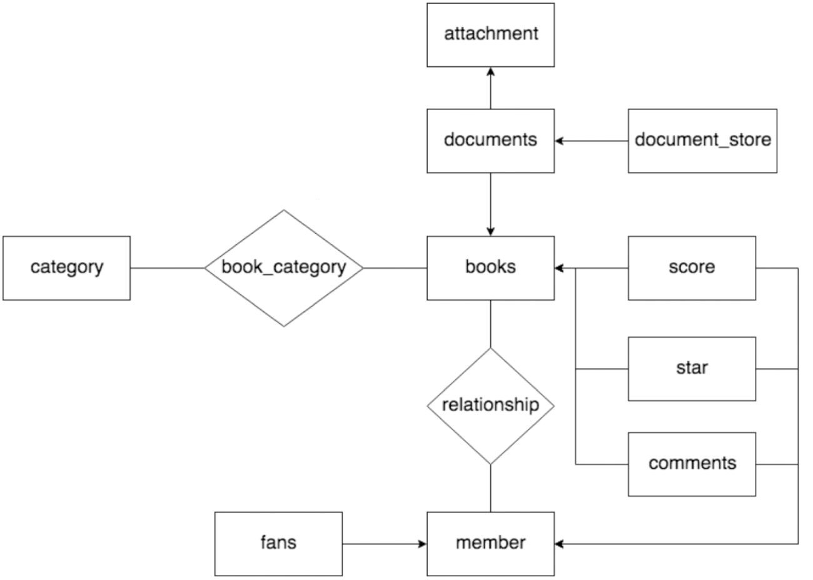

[更新学习笔记](https://github.com/custergo/mbook/commit/388f63ed211c9ff215e188608f4ff0ac852f04a0#diff-0a1d961d8d8f646c1e43a5709a09463aL430)

<a name="3_3"></a>
## 3-3\4\5 Web应用框架搭建技巧

1.首先使用 `bee new mbook` 构建项目框架初始代码

2.修改 `conf\app.conf` 配置文件，增加数据库链接配置

```go
appname = mbook
httpport = 8080
runmode = dev

# MySQL主库配置 w 表示写数据库
db_w_host = 127.0.0.1 # 主库ip地址
db_w_port = 3306 # 主库端口号
db_w_username = root# 主库用户名
db_w_password = root1234# 主库密码
db_w_database = mbook# 主库数据库

# MySQL从库配置 r 表示读数据库
# db_r_host = 
```

3.新建全局的系统初始化目录 `sysinit\init.go` 和数据库初始化文件 `sysinit\dbinit.go`

```go
// sysinit\dbinit.go
package sysinit

import (
	"github.com/astaxie/beego"
	"github.com/astaxie/beego/orm"
    _ "github.com/go-sql-driver/mysql"
	_ "github.com/custergo/mbook/models" // 初始化models里注册的类需要先执行models里的init()函数
)

// 建立数据库连接,参数alias可能代表w主库写库
func dbinit(alias string) {
	dbAlias := alias // default
	if "w" == alias || "default" == alias || len(alias) <= 0 {
		dbAlias = "default" // 默认库的链接
		alias = "w"
	}

	// 拼接数据库链接
	// 数据库名称
	dbName := beego.AppConfig.String("db_" + alias + "_database")
	// 数据库用户名
	dbUser := beego.AppConfig.String("db_" + alias + "_username")
	// 数据库密码
	dbPwd := beego.AppConfig.String("db_" + alias + "_password")
	// 数据库IP
	dbHost := beego.AppConfig.String("db_" + alias + "_host")
	// 数据库端口
	dbPort := beego.AppConfig.String("db_" + alias + "_port")
	// root:root1234@tcp(127.0.0.1:3306)/mbook?charset=urf8
	orm.RegisterDataBase(dbAlias, "mysql",
		dbUser+":"+dbPwd+"@tcp("+dbHost+":"+dbPort+")/"+dbName+"?charset=utf8", 30)
	// 如果是开发模式 isDev 为true
	isDev := ("dev" == beego.AppConfig.String("runmode"))
	// 主库自动建表
	if "w" == alias {
		// false: 发生错误时，不继续执行下一条sql
		// true: 打印日志详细信息
		orm.RunSyncdb("default", false, isDev)
	}
	if isDev {
		orm.Debug = isDev
	}
}
```

继续新增文件 `sysinit\sysinit.go` 做系统的初始化工作

```go
package sysinit

import (
	"github.com/astaxie/beego"
	"path/filepath"
	"strings"
)

func sysinit() {
	// 上传静态资源路径
	uploads := filepath.Join("./", "uploads") // 上传路径
	// 访问域名/uploads即访问到静态资源
	beego.BConfig.WebConfig.StaticDir["/uploads"] = uploads

	// 注册前端使用函数
	registerFunctions()
}

// 静态资源文件views访问函数，需要先在这里声明
func registerFunctions() {
	beego.AddFuncMap("cdnjs", func(p string) string {
		cdn := beego.AppConfig.DefaultString("cdnjs", "") // 配置中有没有cdnjs的参数
		// 有这个参数并以"/"开头和结尾
		if strings.HasPrefix(p, "/") && strings.HasSuffix(cdn, "/") {
			return cdn + string(p[1:]) // 进行拼接域名和参数
		}
	})
}
```

需要在`sysinit\init.go`中调用

```go
package sysinit

func init() {
	sysinit()
	dbinit()
}
```

新增`models\init.go`文件，以初始化models里注册的类需要先执行models里的init()函数

```go
package models

func init() {}
```

最后一步修改 `controllers\default.go` 文件

```go
package controllers

type MainController struct {
	// beego.Controller
	BaseController
}

func (c *MainController) Get() {
	c.Data["Website"] = "beego.me"
	c.Data["Email"] = "astaxie@gmail.com"
	c.TplName = "index.tpl"
}
```

新增 `controllers\BaseController.go` 文件

```go
package controllers

import (
	"github.com/astaxie/beego"
)

type BaseController struct {
	beego.Controller
}

// BaseController统一调用
```

最后修改 `main.go` 文件以启动整个服务

```go
package main

import (
	_ "mbook/routers"
	"github.com/astaxie/beego"、
	"github.com/custergo/mbook/sysinit"
)

func main() {
	beego.Run()
}
```

这样框架就搭建起来了，主要做的是初始化工作
- 初始化数据库链接
- 全局变量、路径的设置
- models里的初始化工作
- BaseController 基础组件的封装

[框架搭建初始化代码](https://github.com/custergo/mbook/commit/4503f3249e80ace155cc1b0612dc3f432aeecf87)

<a name="3_6"></a>
## 3-6 Web应用搭建技巧之重构dbinit

源代码:`sysinit\dbinit.go`

```go
package sysinit

import (
	"github.com/astaxie/beego"
	"github.com/astaxie/beego/orm"
	_ "github.com/go-sql-driver/mysql"
	_ "github.com/custergo/mbook/models" // 初始化models里注册的类需要先执行models里的init()函数
)

// 建立数据库连接,参数alias可能代表w主库写库
func dbinit(alias string) {
	dbAlias := alias // default
	if "w" == alias || "default" == alias || len(alias) <= 0 {
		dbAlias = "default" // 默认库的链接
		alias = "w"
	}

	// 拼接数据库链接
	// 数据库名称
	dbName := beego.AppConfig.String("db_" + alias + "_database")
	// 数据库用户名
	dbUser := beego.AppConfig.String("db_" + alias + "_username")
	// 数据库密码
	dbPwd := beego.AppConfig.String("db_" + alias + "_password")
	// 数据库IP
	dbHost := beego.AppConfig.String("db_" + alias + "_host")
	// 数据库端口
	dbPort := beego.AppConfig.String("db_" + alias + "_port")
	// root:root1234@tcp(127.0.0.1:3306)/mbook?charset=urf8
	orm.RegisterDataBase(dbAlias, "mysql",
		dbUser+":"+dbPwd+"@tcp("+dbHost+":"+dbPort+")/"+dbName+"?charset=utf8", 30)
	// 如果是开发模式 isDev 为true
	isDev := ("dev" == beego.AppConfig.String("runmode"))
	// 主库自动建表
	if "w" == alias {
		// false: 发生错误时，不继续执行下一条sql
		// true: 打印日志详细信息
		orm.RunSyncdb("default", false, isDev)
	}
	if isDev {
		orm.Debug = isDev
	}
}
```

重构代码

```go
package sysinit

import (
	"github.com/astaxie/beego"
	"github.com/astaxie/beego/orm"
	_ "github.com/custergo/mbook/models" // 初始化models里注册的类需要先执行models里的init()函数
	_ "github.com/go-sql-driver/mysql"
)

// 建立数据库连接,参数alias可能代表w主库写库
// dbinit("w","r",...)
func dbinit(aliases ...string) {
	// 如果是开发模式 isDev 为true,则显示命令信息
	isDev := ("dev" == beego.AppConfig.String("runmode"))
	if len(aliases) > 0 {
		for _, alias := range aliases {
			registerDataBase(alias)
			if "w" == alias {
				// false: 发生错误时，不继续执行下一条sql
				// true: 打印日志详细信息
				orm.RunSyncdb("default", false, isDev) // 主库自动建表
			}
		}
	} else {
		registerDataBase("w")
		orm.RunSyncdb("default", false, isDev) // 主库自动建表

	}
	if isDev {
		orm.Debug = isDev
	}
}

func registerDataBase(alias string) {
	if len(alias) <= 0 {
		return
	}
	// 连接名称
	dbAlias := alias // default
	if "w" == alias || "default" == alias {
		dbAlias = "default" // 默认库的链接
		alias = "w"
	}

	// 拼接数据库链接
	// 数据库名称
	dbName := beego.AppConfig.String("db_" + alias + "_database")
	// 数据库用户名
	dbUser := beego.AppConfig.String("db_" + alias + "_username")
	// 数据库密码
	dbPwd := beego.AppConfig.String("db_" + alias + "_password")
	// 数据库IP
	dbHost := beego.AppConfig.String("db_" + alias + "_host")
	// 数据库端口
	dbPort := beego.AppConfig.String("db_" + alias + "_port")
	// root:root1234@tcp(127.0.0.1:3306)/mbook?charset=urf8
	orm.RegisterDataBase(dbAlias, "mysql",
		dbUser+":"+dbPwd+"@tcp("+dbHost+":"+dbPort+")/"+dbName+"?charset=utf8", 30)
}
```

<a name="3_7"></a>
## 3-7 项目整体分析到Controller结构
<a name="3_8"></a>
## 3-8 添加view资源 
<a name="3_9"></a>
## 3-9 【笔记】View构建及其资源准备
<a name="3_10"></a>
## 3-10 【扩展】Beego之View基础实践
<a name="3_11"></a>
## 3-11 一切从model定义开始 
<a name="3_12"></a>
## 3-12 首页Controller实践 
<a name="3_13"></a>
## 3-13\14\15 分类逻辑开发
<a name="3_16"></a>
## 3-16 图书详情、编辑模块设计思路讲解 
<a name="3_17"></a>
## 3-17 图书管理、分类管理模块设计分析
<a name="3_18"></a>
## 3-18 生成图书内容数据
<a name="3_19"></a>
## 3-19 构造搜索查询 
<a name="3_20"></a>
## 3-20/21/22 搜索功能逻辑实现
<a name="3_23"></a>
## 3-23 登录注册验证设计思路简介
<a name="3_24"></a>
## 3-24 社区功能浅析
<a name="3_25"></a>
## 3-25/26/27/28/29 构建社区功能
<a name="3_30"></a>
## 3-30 个人主页剩余模块设计思路讲解
<a name="3_31"></a>
## 3-31 打包部署
<a name="3_32"></a>
## 3-32 项目回顾与总结
<a name="4_mysql"></a>
# 第4章 V1.1 : 补齐短板【MySQL基础优化】
<a name="4_1"></a>
## 4-1 数据库基础优化导读 
<a name="4_2"></a>
## 4-2 【扩展】ab(Apache Bench)基础使用教程
<a name="4_3"></a>
## 4-3 ab压测评估整体并发能力 
<a name="4_4"></a>
## 4-4 为什么查询会慢 
<a name="4_5"></a>
## 4-5 【扩展】MySQL查询执行计划详解
<a name="4_6"></a>
## 4-6 项目开发中怎样设计数据表 
<a name="4_7"></a>
## 4-7 数据表设计实战 
<a name="4_8"></a>
## 4-8 实战数据库索引优化 
<a name="4_9"></a>
## 4-9 索引优化实战 
<a name="4_10"></a>
## 4-10 优化改造数据查询语句 
<a name="4_11"></a>
## 4-11 查询优化性能测试 
<a name="4_12"></a>
## 4-12 【总结】数据库基础优化
<a name="5_update"></a>
# 第5章 V1.5 : 优化数据层并发【MySQL并发优化】
<a name="5_1"></a>
## 5-1 数据库并发优化背景简介 
<a name="5_2"></a>
## 5-2 数据库连接池讲解 
<a name="5_3"></a>
## 5-3 【笔记】Go 连接池分析
<a name="5_4"></a>
## 5-4 Comments分表设计思路与配置 
<a name="5_5"></a>
## 5-5 Comments分表与程序重构 
<a name="5_6"></a>
## 5-6 MySQL binlog初识 
<a name="5_7"></a>
## 5-7 docker基础操作简介 
<a name="5_8"></a>
## 5-8 基于binlog搭建MySQL主从服务 
<a name="5_9"></a>
## 5-9 【笔记】Docker搭建MySQL主从
<a name="5_10"></a>
## 5-10 基于应用层的MySQL读写分离实践 
<a name="5_11"></a>
## 5-11 设计模块分库思路讲解 
<a name="5_12"></a>
## 5-12 数据库垂直拆分应用实践 
<a name="6_es"></a>
# 第6章 V1.8 : 搜索模块优化【搜索模块接入ElasticSearch】
<a name="6_1"></a>
## 6-1 MySQL全文搜索性能评估 
<a name="6_2"></a>
## 6-2 Elasticsearch简介 
<a name="6_3"></a>
## 6-3 安装ES搜索引擎 
<a name="6_4"></a>
## 6-4 Elasticsearch使用基础 
<a name="6_5"></a>
## 6-5 搭建Elasticsearch模块框架 
<a name="6_6"></a>
## 6-6 Elasticsearch创建索引 
<a name="6_7"></a>
## 6-7 搜索模块分析 
<a name="6_8"></a>
## 6-8 搜索模块开发实现 
<a name="7_static"></a>
# 第7章 V2.0:静态缓存优化【页面静态化与伪静态化】
<a name="7_1"></a>
## 7-1 页面静态化与伪静态化简介 
<a name="7_2"></a>
## 7-2 页面静态化方案分析 
<a name="7_3"></a>
## 7-3 filecache包使用简介 
<a name="7_4"></a>
## 7-4 搭建页面静态化框架 
<a name="7_5"></a>
## 7-5 实现pagecache逻辑封装（上） 
<a name="7_6"></a>
## 7-6 实现pagecache逻辑封装（下） 
<a name="7_7"></a>
## 7-7 在BaseController中实现页面静态化 
<a name="7_8"></a>
## 7-8 页面静态化性能测试 
<a name="7_9"></a>
## 7-9 Beego 伪静态化实践 
<a name="7_10"></a>
## 7-10 清理过期缓存文件 
<a name="7_11"></a>
## 7-11 分类缓存改造 
<a name="8_redis"></a>
# 第8章 V2.1:动态缓存优化【基于Redis的动态缓存实践】
<a name="8_1"></a>
## 8-1 动态缓存应用简介 
<a name="8_2"></a>
## 8-2 安装redis服务 
<a name="8_3"></a>
## 8-3 redis基础应用简介 
<a name="8_4"></a>
## 8-4 【笔记】Redis安装以及基础使用
<a name="8_5"></a>
## 8-5 Go实战Redis基础（上） 
<a name="8_6"></a>
## 8-6 Go实战Redis基础（下） 
<a name="8_7"></a>
## 8-7 初始化动态缓存 
<a name="8_8"></a>
## 8-8 封装redis的Do方法 
<a name="8_9"></a>
## 8-9 dynamicache工具方法封装 
<a name="8_10"></a>
## 8-10 实现图书详情页动态缓存逻辑 
<a name="8_11"></a>
## 8-11 实现社区化个人主页动态缓存逻辑 
<a name="9_cdn"></a>
# 第9章 V2.2 : 文件下载优化【文件服务拆分与CDN接入】内容更新中
<a name="10_nginx"></a>
# 第10章 V2.5 : Web服务并发优化【基于Nginx的负载均衡实践】